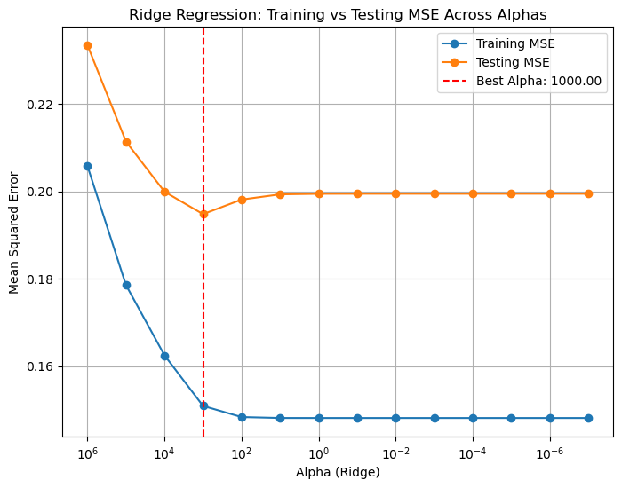

# Problematic-Internet-Use-Predictor

Download of the data can be done at this [Kaggle competition](https://www.kaggle.com/competitions/child-mind-institute-problematic-internet-use/data).  
*Note that, per the competition rules, we cannot publish the dataset on this repo or in our notebooks, so the grader will have to join the competition to get access to the 6GB dataset.*

Reference for using `pandas` on the cluster: [cudf.pandas](https://github.com/rapidsai/cudf)

`EDA.ipynb`  
`DataExploration.ipynb`  
Exploratory Data Analysis step

`DataPP.ipynb`  
Preprocessing Steps  
*Here's our preprocessing plan/outline from Milestone 2, which we implemented in Milestone 3*

The dataset is strange in the fact that a lot of the measured values are 0 when they shouldn't be. A child that weighs 0 does not exist, so we assume that the data recorder put a 0 in some places when they should've put NaN. In other words, for some of the columns, we'll have to replace 0 with NaN.

It's also worthy to note that the dataset contains some sort of null data in every row. In other words, if we just do df.dropna(), the entire dataset gets dropped. 
To help mitigate this issue, we are planning to drop a column if it contains more than 50% null data.

There are also a lot of outliers for each column, so we are planning to remove rows if they have an outlier.

To address the remaining missing values, we will use imputing to insert random values based on the existing values in the particular column. 

We will also scale our data.  
Judging from the histograms of the data, most of the data is not normally distributed, therefore we are opting for min-max normalization instead of standardization.

Lastly, for the columns that contain seasonal data (which is categorical), we will use one hot encoding to transform the categorical data into numerical data. 

Additionally in the `Data__time_series.ipynb` file, we performed preprocessing for the time series data, similar to our approach with the other dataset, but kept it separate to avoid conflicts. We began by inspecting the data for null values, finding none that required imputation. Next, we normalized the numerical columns and applied one-hot encoding to the categorical ones. Due to the dataset's size, which made it challenging to process locally, we randomly sampled a subset for initial preprocessing. However, we plan to use the full dataset later when running it on our models.

## First Model : Linear Model With Lasso/Ridge Regularization

### Question: Where does our data fit in the fitting graph?
answer: The graph comparing training and testing MSEs across alphas for Ridge Regression shows that the testing MSE is consistently higher than the training MSE, as expected. The training error decreases as alpha decreases, and at very low alpha values  (alpha < 10^-2 ), the training error becomes very low, indicating potential overfitting. Conversely, at very high alpha values, the training error increases, suggesting that the model is underfitting due to excessive regularization. The testing error initially decreases as alpha decreases but stabilizes at around alpha < 10^0. The best alpha is alpha = 1000, where the testing error is at its minimum, indicating the model generalizes well and achieves the optimal trade-off between bias and variance. In conclusion, the model fits best at alpha = 1000, as it minimizes the testing error and ensures strong generalization. 

### Question: What are the next models you are thinking of and why?
We are thinking of using polynomial regression for the future because it would increase model complexity and would prevent any potential underfitting that often occurs with linear regression. Note that in polynomial regression we will only stick to degree 2 or 3, as higher degrees tend to lead to overfitting. If a degree 2 or 3 polynomial regression does not appear to be optimal, we will consider other non-polynomial regressions.

We are also considering using support vector machines, since those are best used for classification models. In our case, a classification model is definitely worth considering since our only valid outputs are: 0, 1, 2, or 3. For the same reason, a Naive Bayes classifier is also worth considering.

### Question: What is the conclusion of your 1st model? What can be done to possibly improve it?
The conclusion of our first model with ridge regression was that with an alpha of 1000, we had the most optimal cross validation value and lowest testing error. This value of alpha is quite high which indicates there is a severe penalty on the large coefficients shrinking them towards zero or that there is a very strong "smoothing" effect on the regression coefficients to prevent overfitting. 

