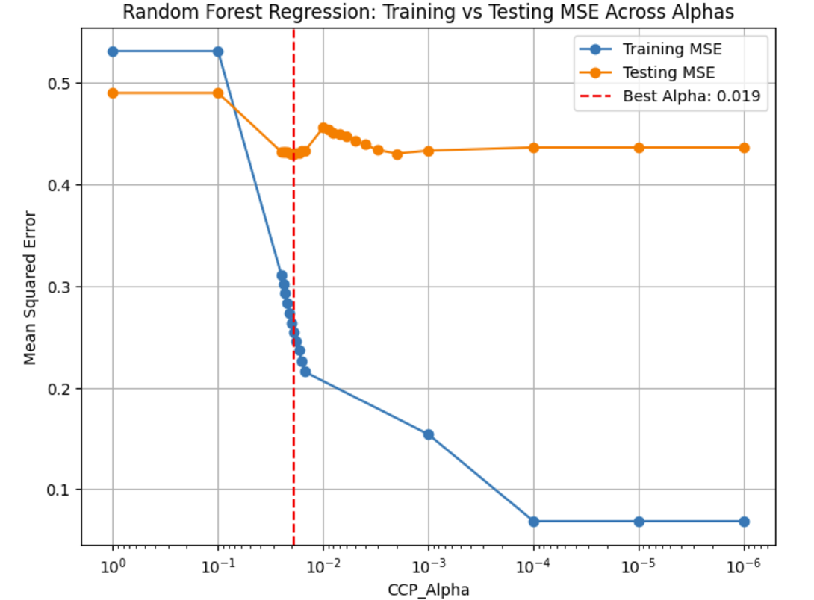
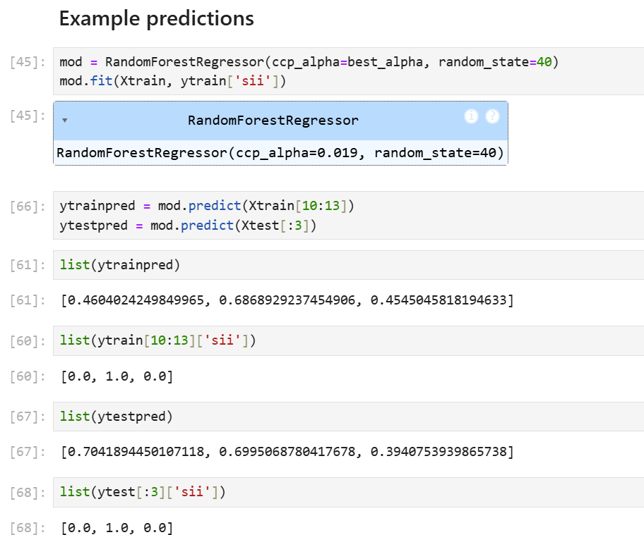

# Problematic-Internet-Use-Predictor

Download of the data can be done at this [Kaggle competition](https://www.kaggle.com/competitions/child-mind-institute-problematic-internet-use/data).  
*Note that, per the competition rules, we cannot publish the dataset on this repo or in our notebooks, so the grader will have to join the competition to get access to the 6GB dataset.*

Reference for using `pandas` on the cluster: [cudf.pandas](https://github.com/rapidsai/cudf)

`EDA.ipynb`  
`DataExploration.ipynb`  
Exploratory Data Analysis step

`DataPP.ipynb`  
Preprocessing Steps  
*Here's our preprocessing plan/outline from Milestone 2, which we implemented in Milestone 3*

The dataset is strange in the fact that a lot of the measured values are 0 when they shouldn't be. A child that weighs 0 does not exist, so we assume that the data recorder put a 0 in some places when they should've put NaN. In other words, for some of the columns, we'll have to replace 0 with NaN.

It's also worthy to note that the dataset contains some sort of null data in every row. In other words, if we just do df.dropna(), the entire dataset gets dropped. 
To help mitigate this issue, we are planning to drop a column if it contains more than 80% null data.

There are also a lot of outliers for each column, so we are planning to remove rows if they have an outlier.

To address the remaining missing values, we will use imputing to insert random values based on the existing values in the particular column. 

We will also scale our data.  
Judging from the histograms of the data, most of the data is not normally distributed, therefore we are opting for min-max normalization instead of standardization.

Lastly, for the columns that contain seasonal data (which is categorical), we will use one hot encoding to transform the categorical data into numerical data. 

Additionally in the `Data__time_series.ipynb` file, we performed preprocessing for the time series data, similar to our approach with the other dataset, but kept it separate to avoid conflicts. We began by inspecting the data for null values, finding none that required imputation. Next, we normalized the numerical columns and applied one-hot encoding to the categorical ones. Due to the dataset's size, which made it challenging to process locally, we randomly sampled a subset for initial preprocessing. However, we plan to use the full dataset later when running it on our models.

# Milestone 3
## First Model : Linear Model With Lasso/Ridge Regularization
https://github.com/k3liang/Problematic-Internet-Use-Predictor/blob/main/Models.ipynb

** Note that for the purposes of answering these questions, we will be focusing on the Ridge Regression linear model.

### Question: Where does our data fit in the fitting graph?
We actually were directly able to make a fitting graph as shown in lecture. This is because the lambda/alpha parameter of the regularization is a hyperparameter that we can tune; we ran a for loop trying out different values, and each value meant a different level of model complexity. So in the fitting graph, we put the test MSE and the train MSE on the y-axis, and on the x-axis, we put the alpha value. To make it so that the positive x-direction meant an increase in model complexity, we had to put the alphas in decreasing order on the x-axis (since smaller alpha means an increase in model complexity). The graph comparing training and testing MSEs across alphas for Ridge Regression shows that the testing MSE is consistently higher than the training MSE, as expected, since a machine learning model will always perform better on seen data. The training error decreases as alpha decreases, which makes sense because as we make the model more complex, the model will more strongly fit to the training data. Conversely, at very high alpha values, the training error increases, suggesting that the model is underfitting due to excessive regularization. The testing error initially decreases as alpha decreases but reaches a "divot" at around alpha=1000, and when alpha decreases beyond that, there's a bit of increase in the test MSE, which indicates that the model is overfitting a little bit for more complex models. Thus, we chose the best alpha to be alpha = 1000, where the testing error is at its minimum, indicating the model generalizes well. The test MSE there is around 0.195, which is pretty solid, considering that the labels can take a value from 0 to 3.

### Question: What are the next models you are thinking of and why?
We are thinking of using polynomial regression for the future because it would increase model complexity and would prevent any potential underfitting that often occurs with linear regression. Note that in polynomial regression we will only stick to degree 2 or 3, as higher degrees would probably be excessive and lead to overfitting (we already have a lot of features). If a degree 2 or 3 polynomial regression does not appear to be optimal, we will consider other non-polynomial regressions.

We are also thinking about warping this problem into a classification question. This is because the label `sii` only is a number from 0 to 3. We have originally been thinking about this in terms of regression since sii an ordinal value (kind of like a letter grade), but classification is another possibility to consider. Thus we can also try out support vector machines, as those will find decision boundaries for multiple classes that optimize margin size. A Naive Bayes classifier and decision tree is also worth considering as potential models if we consider the problem in terms of classification.

### Question: What is the conclusion of your 1st model? What can be done to possibly improve it?
The conclusion of our first model with ridge regression was that with an alpha of 1000, we had the most optimal cross validation value and lowest testing error. This value of alpha is quite high which indicates there is a severe penalty on the large coefficients shrinking them towards zero or that there is a very strong "smoothing" effect on the regression coefficients to prevent overfitting (it makes some sense since we have around 100 features, some of which could be linearly dependent). The testing error of 0.195 was not bad at all for a value that can go from 0-3, which shows that even simple linear relationships can help define a function of a patient's physical attributes to the level of their internet addiction. We can improve the linear model by adding transformed features through techniques like polynomial transformation, square roots, logs, etc. so that we can add more model complexity, but there is a real danger of overfitting if we do so. Another way to improve the model would be possibly to directly do feature selection and remove any redundant columns that are linearly dependent.

# Milestone 4
Please look at `Model2.ipynb` for our work for Milestone 4.  
For our second model, we first had to decide what model we wanted to tune. If you quickly skim `Model2.ipynb`, you will see that we investigated a bunch of different models to get a gist of which ones worked well and which didn't. Eventually, we settled on the Random Forest Regression model (which you can see somewhere in the middle of the notebook), because it did surprisingly well without much hyperparameter tuning initially. Before any rigorous hyperparameter tuning, we were able to get it down to 
a train MSE of 0.3539249959567035 and a test MSE of 0.4337570258421322, which is not bad, considering our labels go from 0 to 3. Of course, our next line of action was to tune the model and avoid overfitting.

### Where does our model fit in the fitting graph?

Like in milestone 3, we actually were directly able to make a fitting graph as shown in the lecture. This is because the `ccp_alpha` hyperparameter of Random Forest Regression is a hyperparameter that we can tune. As stated in the sklearn documentation, the `ccp_alpha` hyperparameter is a "complexity parameter used for Minimal Cost-Complexity Pruning," where 0 means no pruning occurs (and the model is complex), while higher values means more pruning occurs (and the model is simpler). We ran a for loop trying out different values, and we kept narrowing down the range of the `ccp_alpha` hyperparameter to find the smallest possible *test error*. We then were able to make a fitting graph plotting this process. In the fitting graph, we put the test MSE and the train MSE on the y-axis, and on the x-axis, we put the `ccp_alpha` value that we set for that iteration. To make it so that the positive x-direction meant an increase in model complexity, we had to put the ccp_alphas in decreasing order on the x-axis (since smaller ccp_alpha means an increase in model complexity). We also log-scaled the x-axis to make the graph look cleaner.   
The graph comparing training and testing MSEs across ccp_alphas for Random Forest Regression shows that the testing MSE is consistently higher than the training MSE, as expected, since a machine learning model will always perform better on seen data. The training error decreases as alpha decreases, which makes sense because as we make the model more complex, the model will more strongly fit to the training data. Conversely, at very high alpha values, the training error increases, suggesting that the model is underfitting due to excessive pruning. As for the testing error, the testing error initially decreases as alpha decreases but reaches a "divot" at around `ccp_alpha = 0.019` and when alpha decreases beyond that, there's a bit of increase in the test MSE, which indicates that the model is overfitting a little bit for more complex models. Thus, we chose the best `ccp_alpha` to be `ccp_alpha = 0.019`, where the testing error is at its minimum, indicating the model generalizes well. The test MSE there is around 0.43, which is pretty solid, considering that the labels can take a value from 0 to 3.

### Next Models:
We are thinking of using neural networks for our next model. This is because neural networks are really useful for capturing non-linear complex relationships, and this description could be applied to our predictive task. We are trying to predict human behavior after all (child problematic internet use), and this is an inherently non-linear complex problem that could perhaps be mapped onto a neural network. There has already been an attempt made with neural networks close to the bottom of the `Model2.ipynb` file, but we didn't choose this as the model for this milestone because most of the group members were unfamiliar with neural nets. But certainly, to best capture human behavior, neural networks must be considered.

### Conclusion:
The conclusion of our second model with random forest regression was that with a `ccp_alpha` value of 0.019, we had the lowest testing error and thus the most generalizability of the model. The testing error of 0.43 was not bad at all for a value that can go from 0-3. Notice that although a `ccp_alpha` value of 0 works best for the training data, it doesn't do as well for the testing data, providing evidence to the need to prune decision trees because they can easily overfit to data. Another conclusion we can make is that if you look at all the models in totality in `Model2.ipynb`, you'll notice that most of them actually have relatively similar test MSE values. This goes to show the frustrations for ML engineers; we try a bunch of different models, and in the end, they only do better than linear models by a small fraction of error.

There are numerous ways that we can improve our model, and we believe we can do so with further feature engineering -- primarily feature selection or dimensional reduction. These things may significantly improve the performance of our model. Feature selection or dimensional reduction (by something like PCA) helps reduce the dimensionality of the dataset and it allows us to retain the most relevant features, which can lead to a reduction in overfitting and allow the model to generalize well. We should try to reduce the irrelevant features and remove the extra "noise" in our dataset so that the model can more clearly see the patterns in child internet use.

*In the notebook, after training and tuning our random forest regression model, we have some sample predictions.*   

