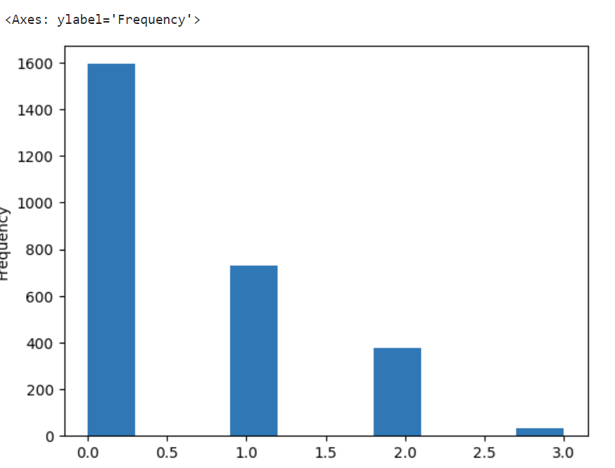
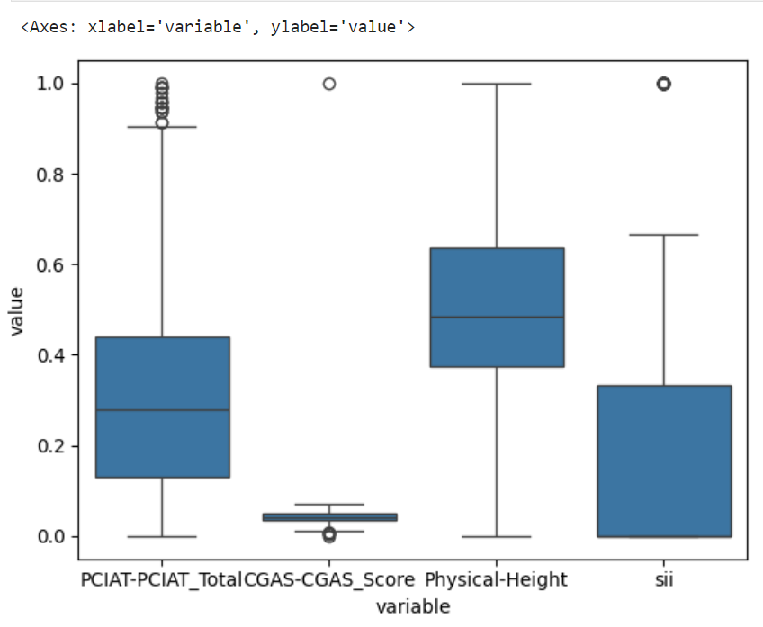
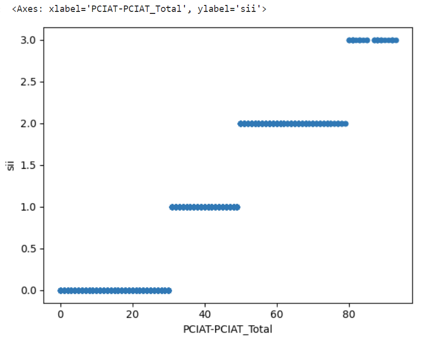
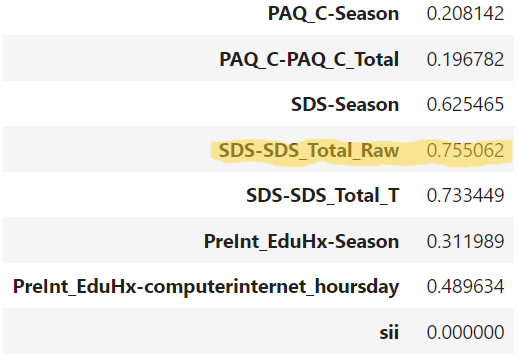
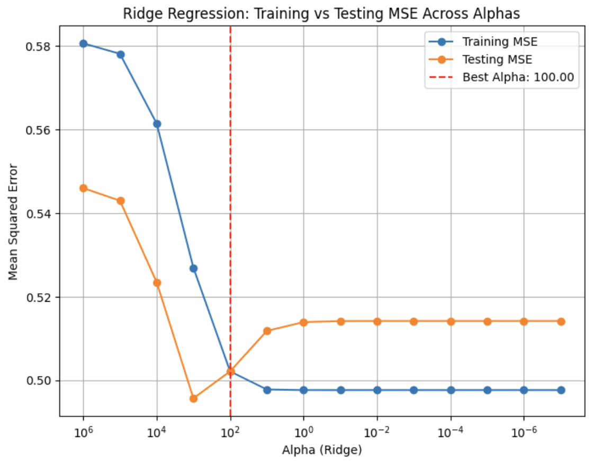

# Introduction  
Our project uses the Kaggle dataset provided by the Child Mind Institute - https://www.kaggle.com/competitions/child-mind-institute-problematic-internet-use/overview. The project centers around predicting whether or not a child has problematic internet use. To be more specific, the model will predict a person’s Severity Impairment Index (SII), an integer from 0 to 3, which is a number established by the Child Mind Institute to measure how excessive a person’s internet use is. The prediction will be based on multiple different measured information about the participant; features include demographics, physical measurements, fitness gram tests, and other assessment scores.  
We chose this topic because it tackles a highly relevant issue in today’s world, where constant internet activity has become deeply entrenched in daily life, often accompanied by reported mental health challenges, and thus many people may connect with this project and find the implications interesting or insightful as a result. A lot of times, you might hear about “iPad kids” that are always impulsively watching something on their electronic devices rather than engaging with the physical world, so it would be really cool if we could somehow classify problematic behavior, so that such behavior could be addressed early on.  
In particular, having a good predictive model of one’s SII based on several of their individual activities or attributes provides good insight into what combination of features is most associated with internet-related mental health challenges, and this information could be distributed to the general public, helping parents guide their children to adopting better lifestyle choices and habits and being more self-aware. Additionally, if a good predictive model is actually deployed, then perhaps parents could make use of the model as a check to the severity of their child’s internet use, and then use that information to make changes that steer the child away from their devices.  
In the context of ML and our learning experience, this project was also very interesting in that the structure of the data as originally presented was very complex and even unusual; a lot of the data was actually missing values, which makes a little sense if you consider that some of the children participants were able to participate more than others (a 5 year old will be able to participate in less tests than a 12 year old, for instance). This will be addressed in the following sections.

# Methods

## Data Exploration

*Data Exploration code can be found in both `DataExploration.ipynb` and `EDA.ipynb`. To make things more organized, we separated the explanation of these files into two subsections.*

`EDA.ipynb`  
We did some basic data exploration of the training set to get a sense of the structure. We got a sense of the size and types of the data: there were 82 different features and 3960 different observations, and while the majority of the 82 features were numerical data – like “weight,” “height,” or “age,” for instance – some of them were of type “object” (ie strings, which are categorical information), but actually, the only string categorical information in this dataset was season data (Fall, Winter, Summer, Spring). We decided this would require one-hot-encoding in the preprocessing step (which will be talked about in the Preprocessing section).

 

Figure 1: A preview of the raw dataset (top image), as well as the types of the features (bottom image)

We also investigated the missing values in our dataset, and we found that almost half of the dataset was missing values (which is something we’ll have to address in the preprocessing section). Every row has a missing value, so it’s not like we can just simply drop all rows that have a missing value.
We also investigated potential outliers in our dataset. We found that a lot of the columns had a minimum value of zero, which didn’t make any sense for some of the columns (0 weight does not make any sense). We’ll have to consider this in the preprocessing section. 

`DataExploration.ipynb`:
After this, we tried to find a relationship between the target SII and some other features via a scatter plot. We did this with “Physical-BMI,” “Basic-Demos-Age,” “CGAS-CGAS_Score,” and “Physical-Weight.” Unfortunately, the scatter plots did not yield any obvious relationship between SII and these other features at first glance. In each of these graphs, however, the points were far more dense for the SII values of 2,1,or 0 than they were for 3, which led us to check for the frequency of each value within the data. After plotting a histogram, it was, surely enough, clear that the index of 3 had a much lower frequency than any other index, and that the index of 0 had a much higher frequency than any other index. This shows that most of the subjects of the training data did not have any significant impairment from internet use, while only a small minority had the most severe such impairment. 

Figure 2: Frequency distribution of SII (severity impairment index) values, indicating that most of the participants were not excessive internet users

After the scatter plots and the histogram, we then decided to use box plots to compare the spread of the data among four different features: “PCIAT_Total,” “CGAS-CGAS_Score,” “Physical-Height,” and of course “SII.” In order to compare them effectively side by side, we used min-max scaling. From this plot, it was clear that the SII index value of 3.0 was so infrequent that it was considered an outlier – the boxplot method can detect outliers by their frequency, and denotes it on the graph as a circle that is detached from the boxplot itself. Additionally, the CGAS-CGAS_Score variable had an outlier that was so disproportionately higher than the rest of the data that the boxplot for this feature was excessively compressed. 

Figure 3: Box plots for the values of `PCIAT-PCIAT_Total` (child internet addiction test scores), `CGAS-CGAS_Score` (“children’s global assessment score”), `Physical Height`, `sii` (severity impairment index)

We then plotted a heatmap with these four features, including SII; the highest correlation coefficient less than 1 with respect to SII (which is displayed between a feature and itself) was 0.9, from PCIAT-Total. 0.9 is an unusually high correlation, so we were skeptical of this result. It turned out that the SII index was directly determined by the PCIAT-Total (we found this out after more deeply investigating the Kaggle dataset description). In particular, the Kaggle dataset description described that for a PCIAT value between 0 and 30, the SII was 0.0; for a value between 30 and 50, the SII was 1.0; for a value between 50 and 80, the SII was 2.0, and for a value higher than 80 the SII was 3.0 (this can be further demonstrated by a scatter plot of the `sii` vs the `PCIAT-PCIAT_Total`). 

Figure 4: Scatterplot of `sii` vs `PCIAT-PCIAT_Total`, demonstrating that `sii` is actually a calculation based on the PCIAT test score

Wanting to find the feature with the highest correlation coefficient from which the SII was not so directly derived, we first dropped the rest of the PCIAT columns so that the same problem would not occur, and created a correlation matrix. After printing out the ‘SII’ column of this matrix, we noticed that the feature with the highest correlation coefficient was SDS-SDS-Total_Raw, with 0.755. This is not at all a low correlation coefficient, and the ‘SII’ index was not directly derived from this feature, so this is an insightful result. *The `SDS-SDS-Total_Raw` score is the sleep disturbance scale score for the participant, which makes sense; if a participant is more heavily using the internet, they’re more severely impacting their sleep.*

Figure 5: Correlation coefficients for a list of some of the features in comparison to the `sii` value, with an emphasis on the particularly high value of correlation between sleep disturbance and severe internet use.

## Data Preprocessing
*Code for the preprocessing part can be found in `DataPP.ipynb`*  
For our preprocessing steps we first had to deal with the fact that the dataset had a lot of 0 measured values when they should not be. For example, there exist child weights in the dataset that are 0; of course this is physically impossible, so we assume that the data recorder puts a 0 in some places to indicate missing data. Thus first we replaced the 0’s for these physical measurement columns with NaN values (to represent that the value is missing rather than being represented as 0, which will affect scaling).  
It is also worthy to note that the dataset contains some null values in almost every row, thus if we just decided to drop all rows with any null values, the entire dataset gets dropped.   
However, to help reduce the number of missing values a little bit we dropped some of the columns/features if the column contains more than 80% null data. The reasoning is that if a column has so little data (only for a few participants), it won’t be extremely useful for predictions for our project’s circumstances.
We then also had a lot of data that looked extreme, or seemed to be outliers, and of course we had to remove these. We tried to first define outliers as any piece of data with an absolute z-score of greater than 3; however the data still seemed mostly skewed so we decided to do a different route. We then tried to define outliers based on interquartile range (IQR). We defined an outlier to be any piece of data less than Q1 - (1.5 * IQR) or any piece of data greater than (Q3 + 1.5*IQR) (this is standard statistics practice). But removing these pieces of data would remove 20% of our data (and we don’t have that many rows, so we probably want to remove less), so we settled on adjusting the outliers to be anything less than (Q1 - 2.5 *IQR) or greater than (Q3 + 2.5 * IQR), this accounted for 7% of our data being outliers.  
After removing our outliers we then had to impute the remaining NaN values in our columns. We did this by imputing our NaN values with random values from the same column. We did this because imputing based on random values in the same column helps us maintain the distribution of our data somewhat, but perhaps better imputing methods could be considered if we had more time.   
Next we made sure to encode the categorical season features as numbers by doing one-hot-encoding.
Finally, we did a scaling of our features. Looking back at our EDA graphs we can also see that most of our data is not normally distributed, so to account for this we used min-max normalization to normalize all the quantitative features of our data to be between 0 and 1. 

Additionally, it should be noted that the Kaggle dataset also included some time series data for some of the participants (some of them wore accelerometers that recorded their movements over a sequence of time — this helps track sedentary behavior). In the `Data__time_series.ipynb` file, we performed preprocessing for the time series data, similar to our approach with the other dataset, but kept it separate to avoid conflicts. We began by inspecting the data for null values, finding none that required imputation. Next, we normalized the numerical columns and applied one-hot encoding to the categorical ones. Due to the dataset's size, which made it challenging to process locally, we randomly sampled a subset for initial preprocessing. However, for this project, we didn’t have any time to integrate the time series data into our models, so this data preprocessing was just extra work that a team member did for completeness.

## Model 1 - Linear Regression
(*Code for the linear model can be found in `Models.ipynb`*)  
For our first model, we explored Lasso and Ridge regression where we performed hyperparameter tuning (the hyperparameter we are tuning is the regularization strength, denoted by `alpha` in `sklearn`). We ran a loop (grid search), iterating the alpha of both models using values from 10^-7 to 10^*7 (log scale iteration), and we found that the most optimal alpha value for Ridge (L2 regularization) was 100 with a `cross_val` value of 10.525 while the most optimal alpha value of lasso (L1 regularization) was 0.001 with a crossval of 10.047. Since the ridge model produced a higher cross validation score value (indicating better generalizable performance), we further examined the fitting graph of the ridge regression model, generating it with the alpha value on the x-axis (to represent model complexity), and the corresponding train and test MSE values on the y-axis to represent model performance. To make it so that the positive x-direction meant an increase in model complexity, we had to put the alphas in decreasing order on the x-axis (since smaller alpha means an increase in model complexity). The fitting graph and results are shown in the results section.

## Model 2 - Random Forest Regression 

(*Code for the second model can be found in `Model2.ipynb`*)  
For our second model, we first had to decide what model we wanted to tune. If you quickly skim `Model2.ipynb`, you will see that we investigated many different models to get a gist of which ones worked well and which didn't. Eventually, we settled on the Random Forest Regression model (which you can see somewhere in the middle of the notebook), because it did surprisingly well without much hyperparameter tuning initially. Before any rigorous hyperparameter tuning, we were able to get it down to a train MSE of 0.3539249959567035 and a test MSE of 0.4337570258421322, which is not bad, considering our labels go from 0 to 3. Of course, our next line of action was to tune the model and avoid overfitting.

Like in the first model, we could make a fitting graph as shown in the lecture. This is because the ccp_alpha hyperparameter of Random Forest Regression is a hyperparameter that we can tune. As stated in the `sklearn` documentation, the ccp_alpha hyperparameter is a "complexity parameter used for Minimal Cost-Complexity Pruning," where 0 means no pruning occurs (and the model is complex). In contrast, higher values mean more pruning occurs (and the model is simpler). We ran a for loop trying out different values, and we kept narrowing down the range of the ccp_alpha hyperparameter to find the smallest possible test error. We then were able to make a fitting graph plotting this process. The fitting graph will be shown in the `Results` section. For extra clarification: to make the fitting graph we plotted the `ccp_alpha` against both our training and testing MSEs for each `ccp_alpha` value that we grid searched. To make it so that the positive x-direction meant an increase in model complexity, we had to put the ccp_alphas in decreasing order on the x-axis (since smaller ccp_alpha means an increase in model complexity). We also log-scaled the x-axis to make the graph look cleaner.
The resulting fitting graph and other results will be shown in the **Results** section.

# Results

Ridge Linear Regression  
Best alpha = 100  
Train MSE: 0.502110725859142  
Test MSE: 0.5021137440264308  

After tuning our ridge linear regression, our optimal alpha value was 100 which produced a train and test mse of 0.502110 and 0.50213 respectively. 

Figure 6: Fitting graph showing model performance vs model complexity for a Ridge Regression model. Model complexity is defined by the `alpha` hyperparameter, which determines the regularization strength of the L2 norm of the weights in the model’s loss function.

Initial Random Forest Regression:  
Train MSE: 0.3539249959567035  
Test MSE: 0.4337570258421322  

Hyperparameter Tuning on Random Forest Regression:  
Best alpha: 0.019  
Train MSE: 0.25471415645593276  
Test MSE: 0.43011595444396405  

Figure 7: Fitting graph showing model performance vs model complexity for a Random Forest Regression Model. Model complexity is defined by the `ccp_alpha` value, which determines how much pruning is done on the decision tree. 

# Discussion

## Data Preprocessing

For our data preprocessing, we performed what are generally considered the standard preprocessing steps. This included removing outliers, imputing null values, dropping rows and columns, encoding categorical features and normalizing/standardizing numerical features. Especially critical was dropping the ‘PCIAT-PCIAT' columns because our target column, ‘sii’, was derived formulaically from these columns (and Kaggle mentions this as well, meaning that we have to remove these columns).  However, looking back there are some shortcomings in our data processing that could have impacted our models' performance. One such shortcoming is the way in which we imputed the data, we imputed missing values in each column based on another value found in the same column, while this method is fine it could have been better, as this method of imputing might have added unnecessary noise into our dataset. Other methods of imputation, such as imputing based on a linear regression, or using mean imputation, might have been better. We also should have run a principal component analysis on our data to only retain the most relevant features for our models.

## Model 1
Firstly, we considered our predictive task as a regression task, even though the SII takes only integer values from 0 to 3. This is because we thought of it as analogous to the letter grade (100,95,90,85,etc.) example from discussion. The SII output value is inherently ordinal; a larger SII means more internet use, so to capture that ordinality, a regression task seems to work. Thus, our model 1 was a baseline model for regression; linear regression, which assumes that all the features are linearly related to the output. To further optimize our linear model, we performed hyperparameter tuning on both the lasso and ridge models using a range of values from 10^-7 to 10^7. Since the ridge regression’s model’s optimal alpha value produced the highest cross validation value, we opted to further explore it with the fitting graph of testing and training mse’s produced by alphas used for tuning the ridge model.

The graph comparing training and testing MSEs across alphas for Ridge Regression shows that the testing MSE is consistently higher than the training MSE, as expected, since a machine learning model will always perform better on seen data. The training error decreases as alpha decreases, which makes sense because as we make the model more complex, the model will more strongly fit to the training data. Conversely, at very high alpha values, the training error increases, suggesting that the model is underfitting due to excessive regularization. The testing error initially decreases as alpha decreases but reaches a "divot" at around alpha=100, and when alpha decreases beyond that, there's a bit of increase in the test MSE, which indicates that the model is overfitting a little bit for more complex models. We chose the best alpha to be alpha = 100, where the cross validation score was maximum indicating the model generalizes well. Notice that the choice for the best alpha based on cross validation did not correspond to the best test MSE; this is fine, because we know cross-validation and test data are two different sources of information, and ultimately, the alpha value that corresponds to the best cross-validation score roughly matches the alpha value corresponding to the best test MSE. Either way, the test MSE at the value of alpha we chose is around  0.502 which demonstrates a moderately effective model considering that the labels can take a value from 0 to 3.

 The fitting graph confirmed that optimal alpha was the value of 100 since at the alpha value of 100, the graph displayed a divot after which the testing mse surpasses the training mse. This alpha value produced a testing mse of  0.502  which was a moderately satisfactory result given that our labels range from 0 to 3. However, the testing mse for this alpha value of 100 was not the lowest since the optimal alpha value was chosen based on the highest cross validation value which is from the training set and it’s preferable that we don’t overfit to the testing set which could occur if we simply selected the alpha with the lowest testing mse. 

The optimal alpha value of 100 is fairly high which indicates there is a significant penalty on the large coefficients shrinking them towards zero or that there is a very strong "smoothing" effect on the regression coefficients to prevent overfitting (it makes some sense since we have around 100 features, some of which could be linearly dependent). The testing MSE of 0.502 was fair given the target variable ranged from 0 to 3 which shows that even simple linear relationships can help define a function of a patient's physical attributes to the level of their internet addiction. 

To discuss some shortcomings of the linear model: we know that the linear regression model is simply a baseline model. It's limited in the fact that it can only capture linear relationships between the features and the output label. But ultimately, the predictive task is about human behavior, which we know is complex and cannot be confined within linear relationships. So perhaps a better model might be able to capture nonlinear relationships of human behavior, which is how we are going to transition to model 2. 

## Model 2
For our second model we decided to use a random forest regression model, as we experimented on different types of models in `Model2.ipynb` and random forest regression seemed to perform the best even without any hyperparameter tuning, so we decided to move on with this model. We also thought that Random forest regression would be the best model to move on with as this model handles non-linear relationships between variables well and we thought that the dataset was filled with these relationships.

Some side notes about the other models that we tested in `Model2.ipynb`. Note that at the bottom of the notebook, we showed that we played around with artificial neural networks a little bit before deciding on Random Forest regression. We initially thought that neural networks would be the best at predicting human behavior based on the different features, and it might capture the non-linear relationships best. However, if you examine the notebook, you'll see that we **overfitted really easily with the neural network model, and it actually usually performed worse than a linear model.** This could be explained by multiple factors. Mainly, the dataset had only 82 features, and a lot of them were randomly imputed (in other words, there's a lot of random noise in the dataset that the neural network could overfit on). In the end, we decided we didn't have enough time to do hyperparameter tuning for the easily overfitting neural network, and additionally, 3 of the 4 members in the team had little knowledge about neural networks (since neural nets had yet to be taught when we made model 2). So we stuck with random forest regression (decision trees were taught in class by the time of milestone 4), and we know that this can still capture non-linear relationships, so it's a step up from a linear regression model.

The graph comparing training and testing MSEs across ccp_alphas for Random Forest Regression shows that the testing MSE is consistently higher than the training MSE, as expected, since a machine learning model will always perform better on seen data. The training error decreases as alpha decreases, which makes sense because as we make the model more complex, the model will more strongly fit to the training data. Conversely, at very high alpha values, the training error increases, suggesting that the model is underfitting due to excessive pruning. As for the testing error, the testing error initially decreases as alpha decreases but reaches a "divot" at around ccp_alpha = 0.019 and when alpha decreases beyond that, there's a bit of increase in the test MSE, which indicates that the model is overfitting a little bit for more complex models. Thus, we chose the best ccp_alpha to be ccp_alpha = 0.019, where the testing error is at its minimum, indicating the model generalizes well. The test MSE there is around 0.43, which is pretty solid, considering that the labels can take a value from 0 to 3.

The conclusion of our second model with random forest regression was that with a ccp_alpha value of 0.019, we had the lowest testing error and thus the most generalizability of the model. The testing error of 0.43 was not bad at all for a value that can go from 0-3. Notice that although a ccp_alpha value of 0 works best for the training data, it doesn't do as well for the testing data, providing evidence to the need to prune decision trees because they can easily overfit to data. Another conclusion we can make is that if you look at all the models in totality in Model2.ipynb, you'll notice that most of them actually have relatively similar test MSE values. This goes to show the frustrations for ML engineers; we try a bunch of different models, and in the end, they only do better than linear models by a small fraction of error.
There are numerous ways that we can improve our model, and we believe we can do so with further feature engineering -- primarily feature selection or dimensional reduction. These things may significantly improve the performance of our model. Feature selection or dimensional reduction (by something like PCA) helps reduce the dimensionality of the dataset and it allows us to retain the most relevant features, which can lead to a reduction in overfitting and allow the model to generalize well. We should try to reduce the irrelevant features and remove the extra "noise" in our dataset so that the model can more clearly see the patterns in child internet use. While our train and test MSE’s for the random forest model had more than a 10% difference, we believe that our model did not overfit as you can see from our fitting graph the model does overfit when CCP_Alpha gets to small but we picked the alpha value where our test set MSE is at its minimum, not when our train MSE is at its minimum. We also performed k-cross validation during our grid search and this technique allows us to ensure that our hyperparameter tuning was not based on just one train test split, thus allowing our model to generalize better.

# Conclusion

Through this project of developing models to predict problematic internet use among children we faced several interesting challenges and we still believe that there is an opportunity to improve this project in the future. Looking back there are several different things that we could implement to improve our models.

The first is the integration of the HBN instruments data (the time series data `Data_time_series.ipynb` that recorded accelerometer data for some of the participants over a long sequence of time). One of our biggest missed opportunities was not properly utilizing the HBN instruments data that was given to us in the Kaggle dataset. This time series data provides key information about the sedentary behavior of children who were monitored. For example, if the child was using the internet a lot, we would expect them to be sitting down and not moving for long periods of time. The accelerometer data would perfectly capture this sedentary behavior (though it would also track normal sleeping as sedentary, which we would have to be aware of). While we found this data complex, and initially daunting, incorporating this data could have provided crucial insights into developing problematic behaviours over time. If we had more time, we could have done some research into processing time series data and including that information into our models for more accuracy in our predictive task.

We could have also done a better job in feature engineering and selection. If we had a more sophisticated approach to feature selection, specifically by implementing Principal Component Analysis (PCA), we might have been able to improve our model performance. Implementing a PCA could have helped us retain only the most important features while reducing the random noise of the other features, which might have led to our model being able to generalize better. We also could have just done feature selection without PCA (feature selection through heatmaps or from examining Lasso regression weights), and this would help reduce redundant features and again keep only the important features to improve model performance; again, we didn’t have time for this, but this is a good direction to go towards in the future.

In addition, while our models (Ridge Regression and Random Forest) did perform adequately, there were several other models that we did not explore. We could have experimented with ensemble methods where we combined multiple models. In addition, we could have also experimented with more classification models (since the label `sii` takes on only integer values from 0 to 3, which could be multi-class classification), perhaps through dense neural networks. We could use hyperparameter tuning on the number of units in the neural network and use activation functions such as sigmoid or softmax to handle the multiclass output.

Looking ahead we feel that this project has potential real-world implications to prevent problematic internet use among children. A more comprehensive model would better serve as a tool that people could use to identify and address patterns before they become actual problems. This problematic internet use issue is becoming more and more relevant today; commonly you’ll hear about the new generation of kids with their internet slang and quirks, and so it is important to begin to address this upcoming trend in generations. Machine learning for diagnosing these bad behaviors seems to be a good start.

# Statement of Collaboration

Kevin - group leader/coder/writer. Kevin was the first to explore the dataset and its quirks; he made the initial data exploration file (`EDA.ipynb`), and he also helped with missing values in the data preprocessing part (`DataPP.ipynb`). He also added a lot of comments in `EDA.ipynb` and `DataPP.ipynb` explaining the notebooks for data preprocessing. For `Models.ipynb`, he refined the hyperparameter tuning for Ridge Regression and Lasso Regression and helped produced the correct fitting graph. Moreover, Kevin worked on most of the `Model2.ipynb` where he explored different models such as decision tree regression, SVM regression, random forest regression, and neural networks in order to find one that would work best as a second model to focus on. He finalized the hyperparameter tuning on the chosen random forest model using the supercomputer and produced the fitting graph. He edited and finalized the submissions for the readmes of Milestone 3 and Milestone 4. He also added on to the Data exploration methods section, as well as the model 1 and model 2 methods sections and discussion, and he helped proofread the report.

Farhat - coder/writer.  Farhat contributed to the data preprocessing in `DataPP.ipynb` by using one hot encoding to convert the categorical column data to numerical data. Moreover, he worked on `Models.ipynb` where a Linear Model was tested as well as Ridge and Lasso Regression Model where the alpha parameter (regularization strength) was tuned for optimal validation score. Additionally, he worked on some initial tuning for model 2. He also worked on editing the readmes for the submissions for Milestone 3 and 4, and he helped write up the model 1 methods section of the final report.

Michael - coder/writer. Michael contributed to the data preprocessing in `DataPP.ipynb`: preprocessing steps he did included imputing missing values through random choice, and dropping columns with null values in excess of 80%. He also worked on the preprocessing of the complex time series parquet data that came with the main dataset from Kaggle (even though we didn’t use the time series data in the final model, this is still work worth mentioning). Moreover, he further optimized the hyperparameter tuning on the random forest model in `Model2.ipynb` using more rigorous grid search. He helped write up the data preprocessing, conclusion and discussion section of the final report.

Advait - coder/writer - Advait worked on `DataExploration.ipynb` where he made various graphs to analyze the dataset and wrote extensive comments for its associated notebook. He also added extensive comments to `Models.ipynb` and helped in editing the write ups for Milestone 3 and Milestone 4, and in editing the Data Exploration methods, Data Preprocessing, and Introduction section of the final report.

